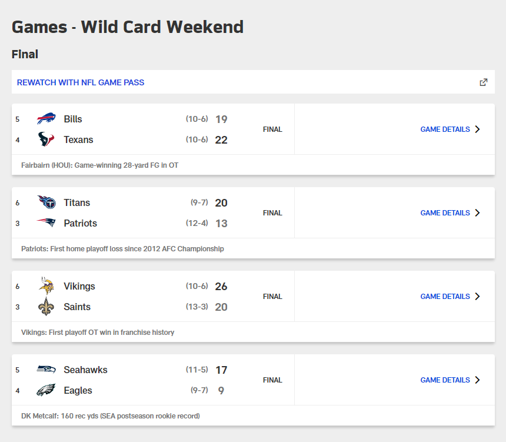
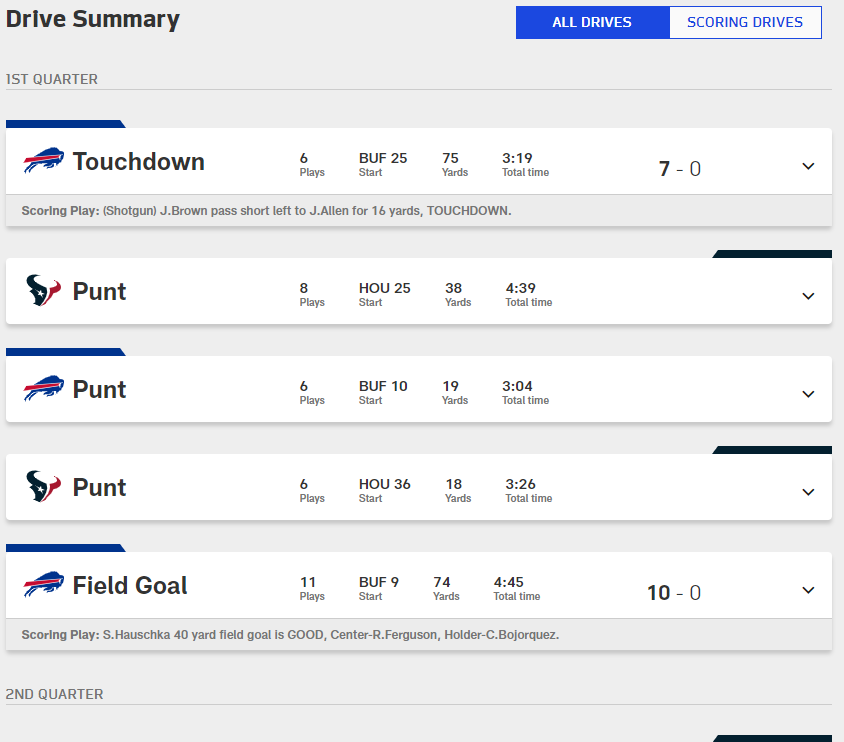

# Scoreboard Sample
Create a sample scoreboard application to demonstrate proficiency in web development. Example scores and stats can be of any sport/game or other example scenario and can have any UI elements you desire. Code is more important than appearance, but app should include examples both styling and scripting. App should be a single-page web app with the following requirements.

## View - Scores
List scores of recent games. Example should illustrate scores updating dynamically and new games added to the top of the list. Clicking on a game should bring you to Details view.

## View - Details
Show game activity/details.

## IFrame Data Source
App should communicate with a page in a hidden iframe as the source of all data. Data source page should deliver results in response to request from app, such as an initial load of scores/details, as well as providing unsolicited updates of new games and scores.
